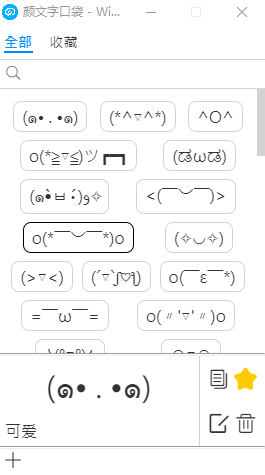

# 颜文字口袋

PC 软件。便捷输入、收藏、编辑颜文字的工具。

## 依赖

- Electron
- Vue

## 功能

- 保存、收藏颜文字。
- 复制颜文字到剪贴板。
- 始终保持前端，灵活最小化。

## 使用方法

1. 下载源码
2. 安装依赖：`npm install`
3. 控制台中运行：`npm run package`
4. 在 code/release 可以看到打包后的程序
